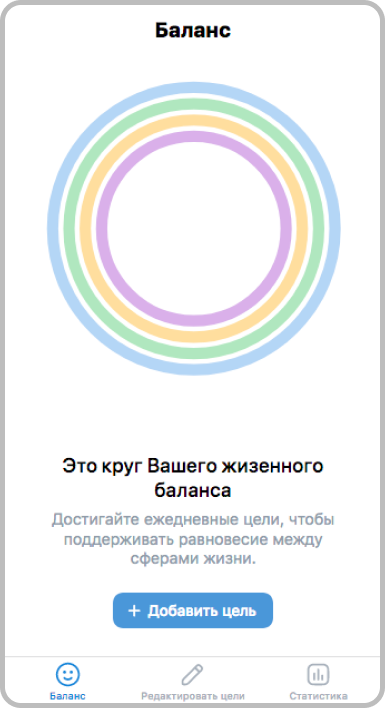

[](https://vk.com/services)

# Баланс

Приложение служит для поддержания баланса в различных сферах жизни. Это происходит при помощи ежедневного трекинга целей.

##### Скриншот главного экрана

 
# Возможности

- Добавлять / изменять ежедневные цели
- Записывать свой прогресс по каждой из целей
- Отслеживать заполненность баланса в жизненных сферах
- Просматривать статистику за различные дни

# TODO
- [x] Добавление / изменение целей
- [x] Трекинг процесса достижения двумя способами (время и разы)
- [x] Прогрес досижения по каждой из целей и в разрезе всех жизненных сфер
- [x] Статистика за предыдущие дни
- [ ] Таймер для трекинга времени прямо в приложении
- [ ] Новые рекомендации ежедневных привычек и целей
- [ ] Хранение данных в базе по VK id

# Демо/запуск проекта

Посмотреть можно по ссылке [https://prod-app7397345-6ef36a5ad813.pages.vk-apps.com/index.html](https://prod-app7397345-6ef36a5ad813.pages.vk-apps.com/index.html)

Чтобы запустить проект на своём компьютере — достаточно склонировать репозиторий и выполнить команды:
```
npm install
npm start
```
После введения команд готовый проект откроется в браузере автоматически.
